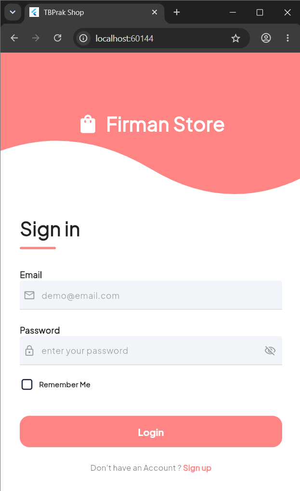
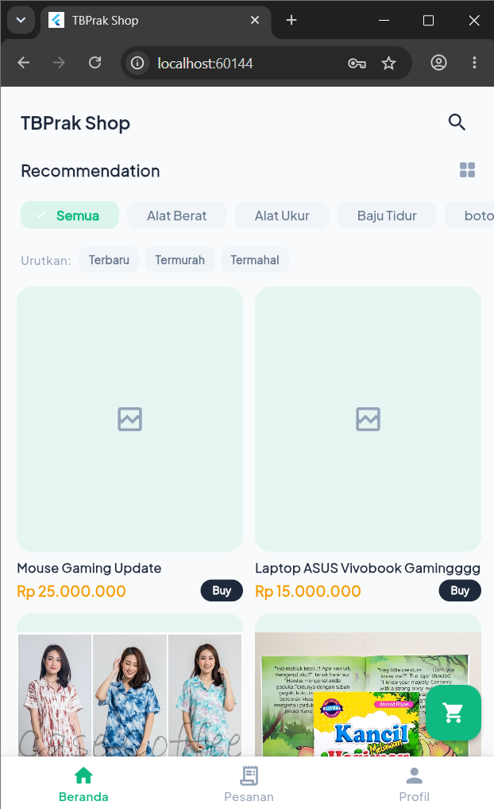

# TB_Mobile - Praktikum Pemrograman Mobile 2025/2026

## Identitas
- **Nama:** [Firman Nurhakim]
- **NIM:** [2306107]
- **Kelas:** [Kelas A]

## Deskripsi
Aplikasi e-commerce berbasis Flutter ini dibuat sebagai Ujian Akhir Semester (UAS) mata kuliah Praktikum Pemrograman Mobile. Aplikasi ini mengkonsumsi REST API yang telah disediakan dan mengimplementasikan fitur autentikasi, katalog produk, keranjang belanja, serta manajemen pesanan.

## Daftar Fitur yang Diimplementasikan

### 1. Autentikasi & Profil
- Register dengan validasi form dan pemanggilan API endpoint `/auth/register`.
- Login, menerima token, dan menyimpannya menggunakan SharedPreferences/Local Storage.
- Fitur Auto-login.
- Halaman Profil untuk menampilkan data user dan update profil (`PUT /auth/profile`).
- Logout (menghapus token lokal).

### 2. Katalog Produk
- Menampilkan daftar produk (`GET /products`) dalam bentuk `GridView`/`ListView` dengan pagination/infinite scroll.
- Fitur pencarian produk berdasarkan nama (`?search=`).
- Filter produk berdasarkan kategori (`GET /categories`) dengan tampilan Chip/Dropdown/Tab.
- Sorting berdasarkan harga termurah, termahal, atau terbaru (`?sort=`).
- Halaman Detail Produk (`GET /products/:id`) yang menampilkan informasi lengkap termasuk daftar ulasan.
- Fitur "Tambah ke Keranjang" (`POST /cart`) dan form menulis ulasan baru.

### 3. Keranjang Belanja
- Menampilkan daftar item keranjang (`GET /cart`).
- Interaksi keranjang: tambah/kurang kuantitas (`PUT /cart/:id`), hapus item tertentu (`DELETE /cart/:id`), dan tombol untuk mengosongkan seluruh keranjang dengan konfirmasi (`DELETE /cart`).
- Badge counter pada ikon keranjang di navigation bar.
- State penanganan apabila keranjang kosong (ilustrasi + pesan informatif).

### 4. Checkout & Riwayat Pesanan
- Halaman Checkout dengan ringkasan pesanan, form alamat pengiriman, dan form catatan opsional.
- Dialog konfirmasi sebelum `Buat Pesanan` (`POST /orders`).
- Halaman Riwayat Pesanan yang menampilkan daftar pesanan (`GET /orders`).
- Halaman Detail Pesanan (`GET /orders/:id`) yang menampilkan indikator warna untuk setiap status pesanan.

### 5. Fitur Tambahan / Admin Panel
*(Silakan hapus salah satu opsi di bawah ini sesuai dengan fitur tambahan yang Anda kerjakan)*
- **Opsi A: Admin Dashboard** (Halaman statistik, daftar produk terlaris, dan manajemen/update status pesanan).
- **Opsi B: Fitur User Lanjutan** (Wishlist lokal dengan SQLite/Hive, Dark Mode dengan toggle switch di profil, dan Notifikasi Lokal saat pesanan berhasil).

## Screenshot Aplikasi
*(Tambahkan minimal 5 halaman screenshot aplikasi di bawah ini dengan mengganti URL gambar)*
1. **Halaman Login & Register**


2. **Halaman Katalog Produk**


3. **Halaman Detail Produk**


4. **Halaman Keranjang**


5. **Halaman Checkout & Riwayat Pesanan**


## Cara Menjalankan Aplikasi

1. Clone repository GitHub ini:
   ```bash
   git clone https://github.com/inisial5217/TB_Mobile.git
   ```
2. Pindah ke dalam direktori aplikasi (jika berada di root):
   ```bash
   cd tb_ecommerce
   ```
3. Install semua dependencies yang dibutuhkan:
   ```bash
   flutter pub get
   ```
4. Jalankan aplikasi pada emulator atau perangkat yang terhubung:
   ```bash
   flutter run
   ```

*Catatan: APK versi rilis dapat ditemukan pada folder `/release` atau pada link eksternal jika disediakan.*
